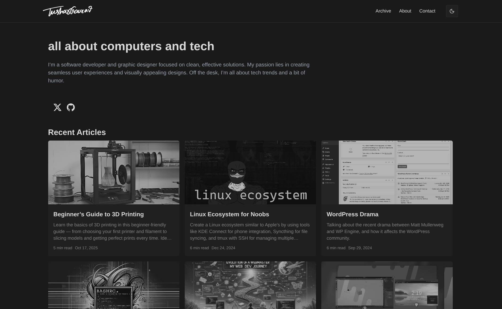

# Tushar's Personal Website

Fifth time's the charm. (The [first](https://github.com/tushgaurav/site-old), [second](https://github.com/tushgaurav/tushgaurav.in-django), [third](https://github.com/tushgaurav/old.tushgaurav.in), and [fourth](https://github.com/tushgaurav/personal-blog) weren't.)



My personal website built with Next.js, Payload CMS, and TypeScript. It's where I share blog posts, hobbies, and projects.

## About

This is the source code for [tushgaurav.com](https://tushgaurav.com). It's a simple yet powerful site combining a headless CMS with a modern frontend. Write content in Payload, and it automatically shows up on the website.

## Tech Stack

- Next.js with TypeScript, Tailwind CSS, and Shadcn UI
- Payload CMS
- PostgreSQL (Neon) + Drizzle ORM

## Getting Started

### Prerequisites

- Node.js v22+ (v24 recommended)

### Running Locally

1. Clone the repo:

   ```bash
   git clone git@github.com:tushgaurav/site.git
   cd site
   ```

2. Install and setup:

   ```bash
   pnpm install
   cp .env.example .env
   # Add your PostgreSQL URI to .env
   ```

3. Start the dev server:
   ```bash
   pnpm dev
   ```

Open [http://localhost:3000](http://localhost:3000) and you're good to go!

### Using Docker

If you prefer Docker:

```bash
docker-compose up
```

### File Structure and Naming Conventions

- All base level components are in `src/components`, these are components that are used across the entire application.
- Page specific components are in `src/app/(frontend)/<page-name>/_components`, these are components that are used on a specific page or a group of pages, these are generally not used higher up in the component tree.
- Generally, all components should be named like `component-name.tsx` in lower case with hyphens separating the words.

## Contributing

Found a bug or have an idea? Feel free to open an issue or submit a PR. I'd love the help!
